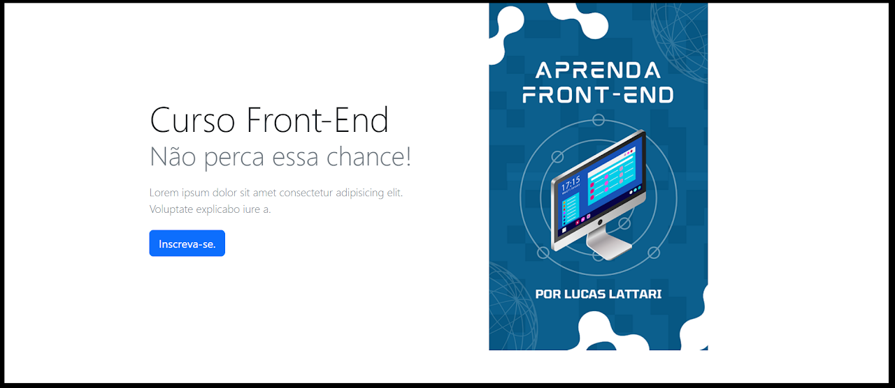

# Primeira atividade

Instruções fornecidas:

1. Crie um repositório no GitHub para guardar os projetos dessa disciplina;
2. Usando as tecnologias elencadas no tópico dessa semana, crie uma página similar a apresentada abaixo usando Bootstrap. A submissão será feita pelo SIGAA e deverá conter:
* O link da pasta contendo a tarefa dessa semana no GitHub;
* Um áudio entre 2 e 5 minutos ou vídeo explicando o código-fonte de seu projeto;



## Solução

Dependências utilizadas:
* bootstrap
* express
* nodemon (dev)
* sass (dev)

Foi realizado o download da biblioteca *Bootstrap* utilizando o gerenciado de pacotes para Node.js NPM, e utilizado o compilador *Sass* para importar o *Bootstrap*.

Para iniciar o ambiente de desenvolvimento foi configurado um comando no **package.json** para iniciar o nodemon, este reinincia o servidor *express* sempre que for atualizado um arquivo scss ou html. Quando é salvo uma alteração em um arquivo scss, o comando compila um arquivo css que é disponibilizado de forma estática pelo servidor *express*. O comando pode ser acionado utilizando o NPM como mostrado a seguir:

```bash
> npm run dev
```

O compilador *sass* esta configurado para salvar o arquivo gerado no diretório **public/styles**.